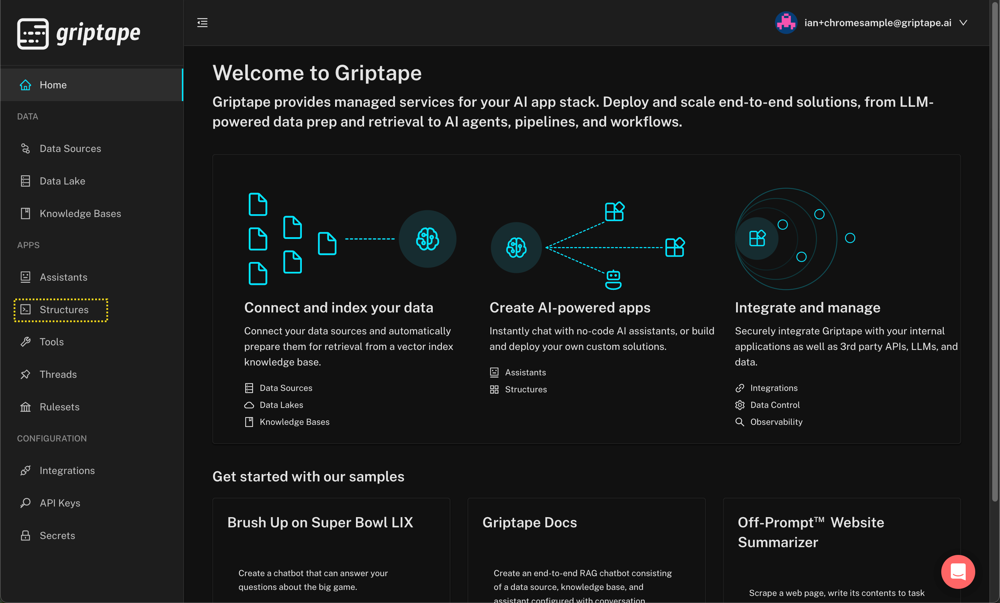
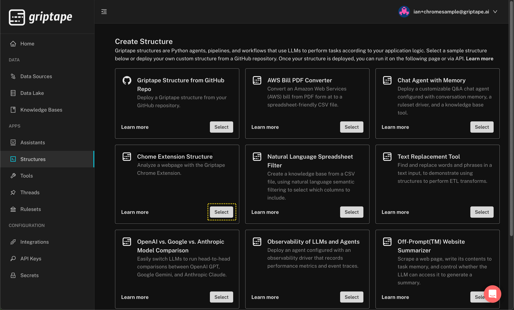
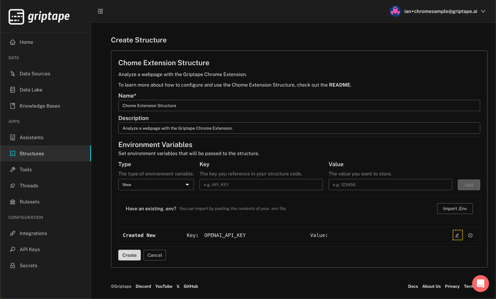
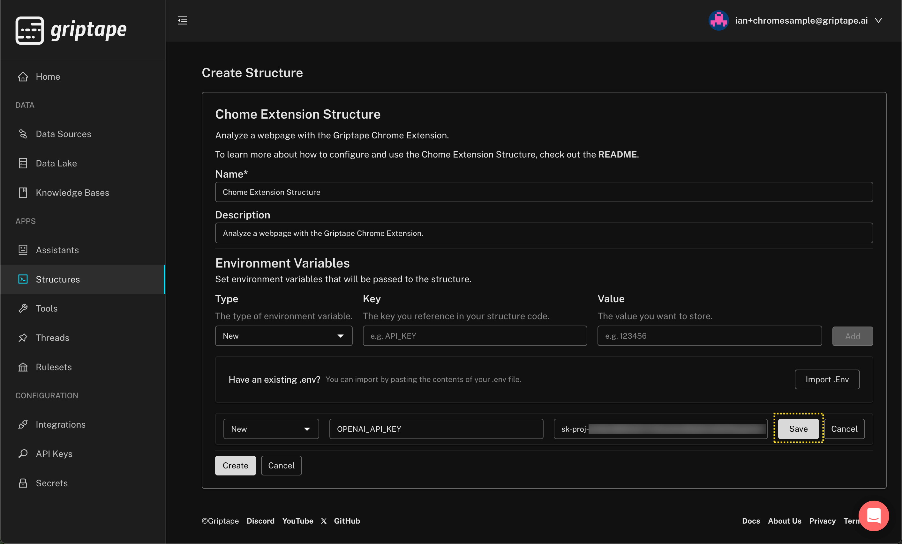
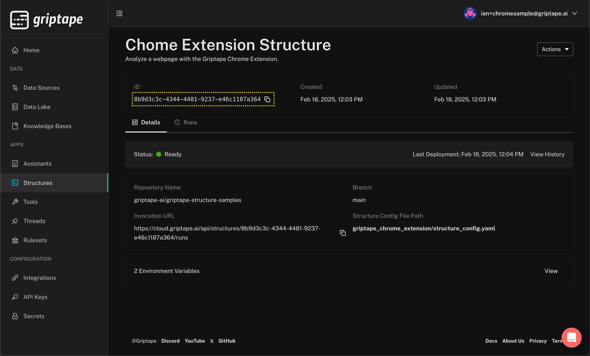

# Griptape Cloud Sample Structure for the Chrome Browser Extension

How to deploy the Sample Structure.

1. Navigate to [cloud.griptape.ai](https://cloud.griptape.ai) and create a free account. The simplest way is to use your existing Google or GitHub ID to sign up for Griptape Cloud. 
1. Once logged to Griptape Cloud in you will see the [Griptape Cloud Console](https://cloud.griptape.ai/). Select *Structures* from the menu on the left side.

1. Click the *Create Structure* button on the top right of the structures page. Next, click the *Select* button on the *Chome Extension Structure* card.

1. You will be taken to a prepopulated *Create Structure* page for the Chrome Extension Structure. To finalize the Structure configuration, you need to add the value for your OpenAI API key to the newly created `OPENAI_API_KEY` the *Environment Variables* section. To do this, click on the pen icon to the right of the value, shown below.
 
1. OpenAI API keys usually start with the prefix `sk-proj` and are 164 characters in length. 
Once you have entered your OpenAI API key, your completed *Create Structure* page should look like this. Click the *Save* the right of the OpenAI API key value and save your updated environment variable. 

1. Click on the *Create* button at the bottom of the Create Structure page. You will be redirected to the Structure detail page, and after about a minute or so the Status should show *Ready*, indicating that deployment is complete and your Structure is ready for use.
1. To use this Structure with the Browser Extension you will require the Structure ID. You can see this highlighted in the image below, and you can quickly copy it to your clipboard by clicking the copy icon to the right of the Structure ID.

### That's it. You have successfully deployed your first Structure to Griptape Cloud