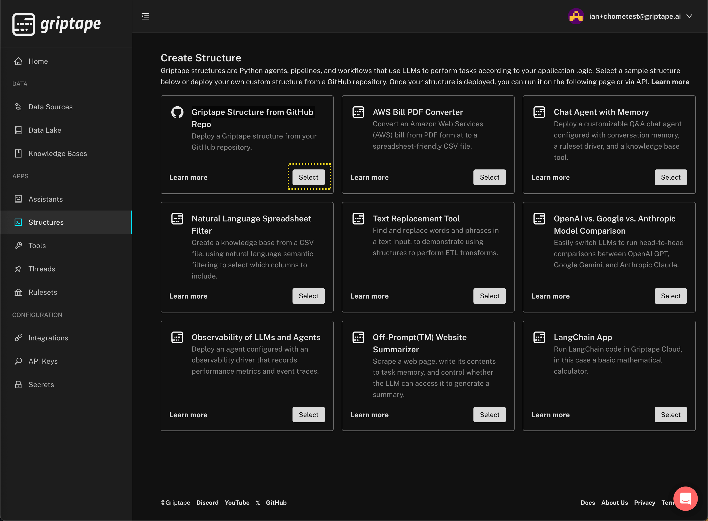
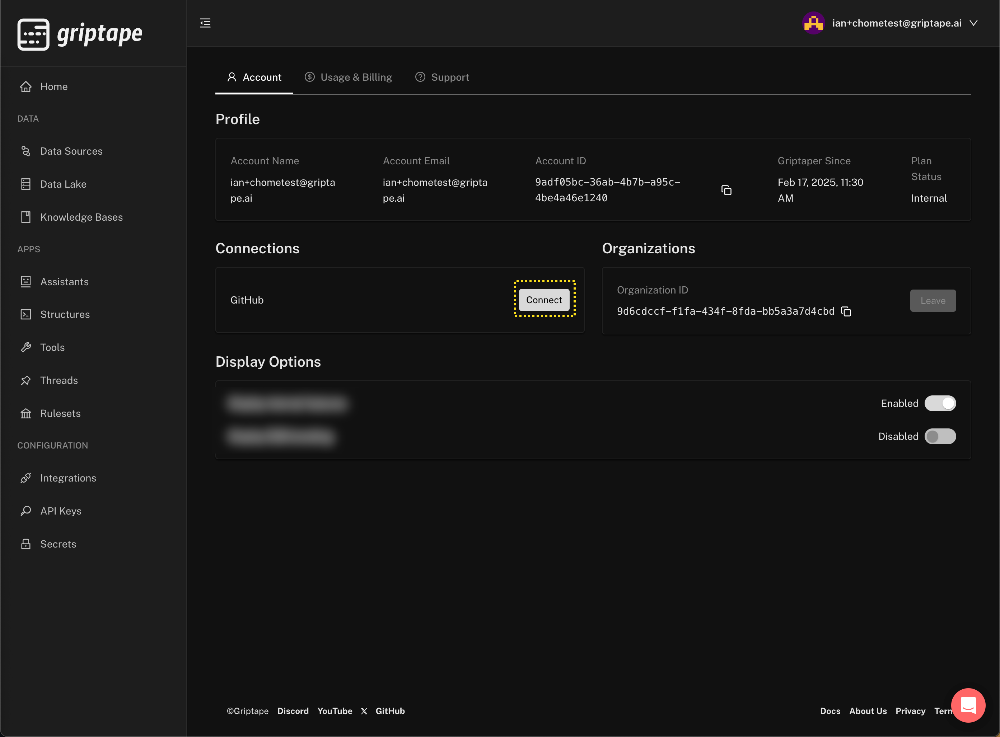
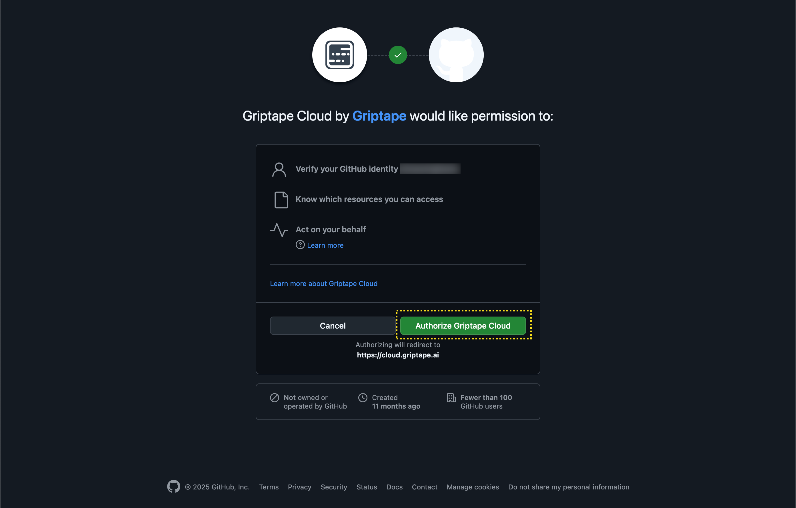
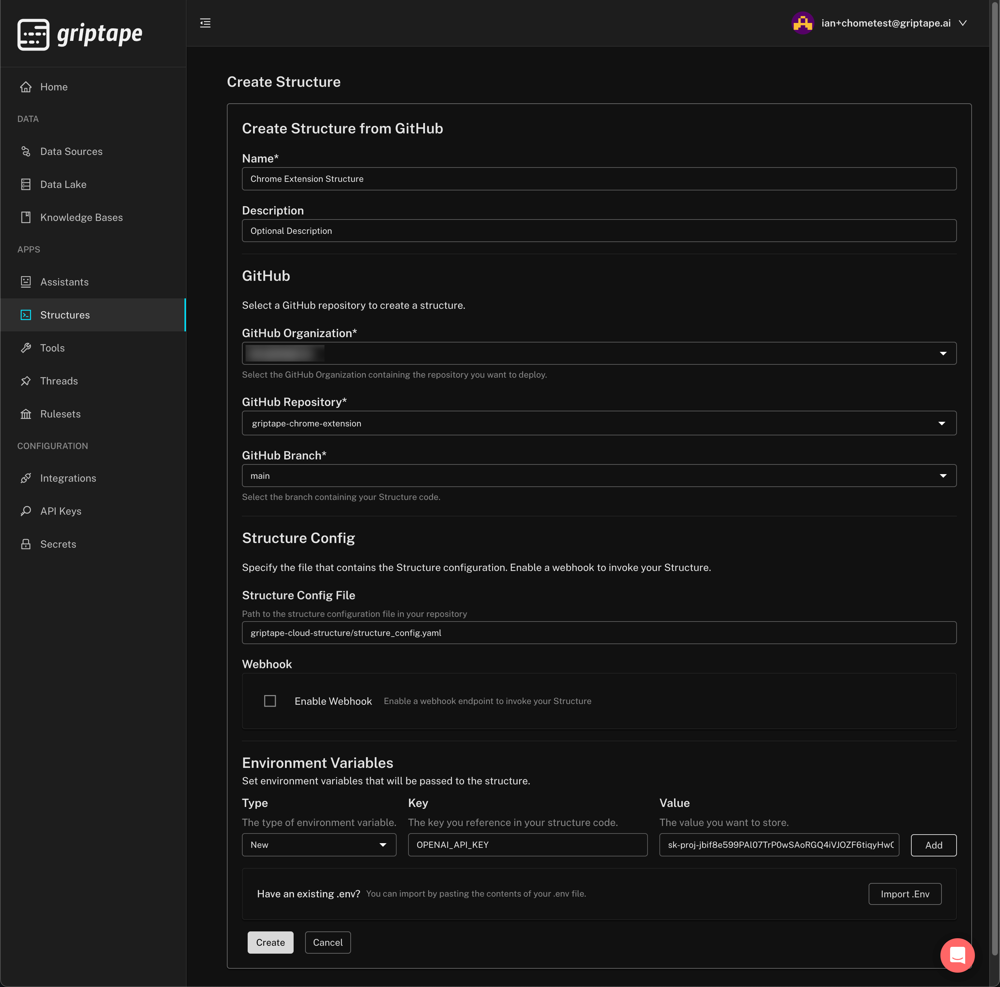
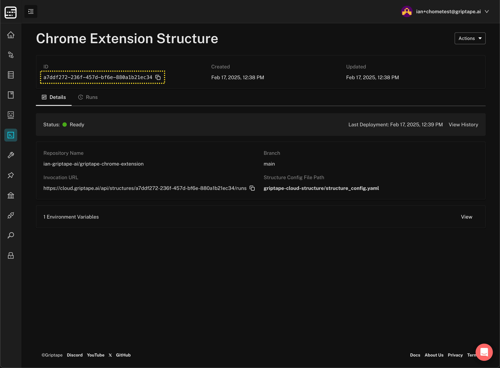

# Example Griptape Cloud Structure for the Chrome Browser Extension

How to deploy.

1. Make sure you have cloned [this repository](https://github.com/ian-griptape-ai/griptape-chrome-extension) into your own GitHub account.
1. Navigate to [cloud.griptape.ai](https://cloud.griptape.ai) and create a free account. The simplest way is to use your existing Google or GitHub ID to sign up for Griptape Cloud. 
1. Once logged to Griptape Cloud in you will see the [Griptape Cloud Console](https://cloud.griptape.ai/). Select *Structures* from the menu on the left side.

1. Click the *Create Structure* button on the top right of the Structures page. Next, click the *Select* button on the *Griptape Structure from GitHub Repo* card.

1. On the next page click the *Manage GitHub Connection* button in the *Create Structure from GitHub* card. You will be taken to the [Account](https://cloud.griptape.ai/account) page. Click the *Connect* button in the GitHub section underneath the *Connections* header.

1. You will be redirected to GitHub and asked to confirm where you want to install Griptape Cloud. Ensure that you are signed into the the same account or organization where you cloned the Griptape Chrome Extension repository in step 1. Once you are signed in, click the *Authorize Griptape Cloud* button.

1. You will then be prompted to select which repositories you wish to give Griptape Cloud permission to access. Ensure that the Griptape Chrome Extension repository that you cloned in step 1 is included in the scope that you select. Once you see the message confirming that "**Okay, Griptape Cloud was installed on the @<your_account_name> account.**", you can return to your [Griptape Account](https://cloud.griptape.ai/account) page. Once you refresh this page, you will see the status of the GitHub connection change from *Connect* to *Manage*, indicating that your GitHub account has been connected successfully.
1. Return to the [Create Structure from GitHub](https://cloud.griptape.ai/structures/create/github-creation) page in the Griptape Cloud Console by selecting the *Structures* option in the left navigation panel, clicking on the *Create Structure* button, and clicking the *Select* button on the *Griptape Structure from GitHub Repo* card. Alternatively, use the direct link at the beginning of this step.
1. Enter a name for your Structure. I used 'Chrome Extension Structure'. Name is a required field. You may optionally enter a description for your Structure. In the *GitHub* section, in *GitHub Organization* select the organization or user that you cloned the Griptape Chrome Extension repository to in step one. In *GitHub Repository* select the cloned repository (**griptape-chrome-extension**), and in *GitHub Branch* select *main*. 
1. In the *Structure Config* section, set *Structure Config File* to `griptape-cloud-structure/structure_config.yaml`
1. Next, scroll the bottom of the page and enter your OpenAI API key in the *Environment Variables* section. The *Type* should be set to *New*. *Key* shoud be set to `OPENAI_API_KEY` and *Value* should be your OpenAI API key. OpenAI keys usually start with the prefix `sk-proj` and are 164 characters in length. Your completed *Create Structure* should look like this:

1. Click on the *Create* button at the bottom of the Create Structure page. You will be redirected to the Structure detail page, and after about a minute or so the Status should show *Ready*, indicating that deployment is complete and your Structure is ready for use.
1. To use this Structure with the Browser Extension you will require the Structure ID. You can see this highlighted in the image below, and you can quickly copy it to your clipboard by clicking the copy icon to the right of the Structure ID.

### That's it. You have successfully deployed your first Structure to Griptape Cloud